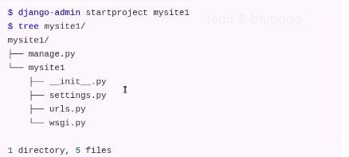

# 《Django Web教学笔记》
* 课程特点：
    1. 学习难度大，大部分内容需要理解并记忆
    2. 文件较多易混淆
    3. 学习阶段注重框架使用，工作阶段注重实践业务逻辑
    4. 综合应用强，小练习少
## Django框架的介绍
* 2005年发布，采用Python语言编写的开源Web框架
* 早起的时候Django主做新闻和内容管理的
* 一个重量级的Python Web框架，Django配备了常用的大部分组件
    1. 基本配置
    2. 路由系统
    3. 原生HTML模板系统
    4. 视图view
    5. Model模型，数据库连接和ORM数据库管理
    6. 中间件
    7. Cookie & Session
    8. 分页
    9. 数据库后台管理系统admin
* Django的用途
    * 网站后端开发
    * 微信公众号、微信小程序等后台开发
    * 基于HTTP/HTTPS协议的后端服务器开发
        * 在线语音/图像识别服务器
        * 在线第三方身份验证服务器等
* Django的版本
    * 最新版本：2.2.X
    * 当前教学版本：1.11.8
* Django的官网
    * 官方网址：http://www.djangoproject.com
    * 中文文档(第三方):
        * https://yiyibook.cn/
        * http://djangobook.py3k.cn/
    * Django的离线文档
        1. 解压数据包 django-doc-1.11-en.zip
        2. 用浏览器打开 django-docs-1.11-en/index.html
## Django的安装
* 查看已安装的版本
    ```html
    >>>import django
    >>>print(django.VERSION)
    (1,11,8,'final',0)
    ```
* 安装
    1. 在线安装
        * $ sudo pip3 install django安装django的最新版本
        * 或
        * $ sudo pip3 install django[==版本] 安装django的指定版本
        * 如
            * $ sudo pip3 install django==1.11.8
    2. 离线安装
        * 下载安装包
        * 安装离线包
            * $ tar -xvf Django-1.11.8.tar.gz
            * $ cd Django-1.11.8
    3. 用wheel离线安装
        * 下载安装包
            * pip3 download -d /home/weimz/django_packs
              django==1.11.8
        * 安装离线包
            * $ pip3 install Django-1.11.8.whl
* Django的卸载
* $ pip3 unintall django
* Django的开发环境
    * Django1.11.X支持Python2.7,3.4,3.5和3.6(长期支持版本LTS)
    * 注：Django1.11.X不支持Python3.7
## Django框架开发
### 创建项目的指令
* $ django-admin startproject 项目名称
* 如：
    * $ django-admin startproject mysite1
* 运行
```html
$ cd mysite1
$ python3 manage.py runserver
# 或
$ python3 manage.py runserver 5000 # 指定只能本机使用127.0.0.1的5000端口访问本机
```
## Django项目的目录结构
* 示例:

* 项目目录结构分析
    * manage.py
        * 此文件是项目管理的主程序，在开发阶段用于管理整个项目的开发运行的调式
        * manage.py包含项目管理的子命令，如：
            * python3 manage.py runserver 启动服务
            * python3 manage.py startapp 创建应用
            * python3 manage.py migrate 数据迁移
            * ...
    * mysite1 项目包文件夹
        * 项目包的主文件夹(默认与项目名称一致)
        1. __init__.py
            * 包初始化文件，当此项目包被导入(import)时此文件会自动运行
        2. wsgi.py
            * WSGI即Web Server Gateway Interface
            * WEB服务网关接口的配置文件，仅部署项目时使用
        3. urls.py
            * 项目的基础路由配置文件，所有的动态路径必须先走该文件进行匹配
        4. settings.py
            * Django项目的配置文件，此配置文件中的一些全局变量将为Django框架的运行传递一些参数
            * settings.py配置文件，启动服务时自动调用
            * 此配置文件中也可以定义一些自定义的变量用于作用全局作用域的数据传递
    * settings.py文件介绍
        1. BASE_DIR
            * 用于绑定当前项目的绝对路径(动态计算出来的)，所有文件都可以依赖此路径
        2. DEBUG
            * 用于配置Django项目的启动模式取值：
                1. True表示开发环境中使用调试模式(用于开发中)
                2. False表示当前项目运行在生产环境中(不启用调试)
        3. ALLOWED HOSTS
            * 设置允许访问到本项目的网络地址列表，取值：
                1. []空列表，表示只有127.0.0.1,localhost,'[::1]'能访问本项目
                2. ['*'],表示任何网络地址都能访问到当前项目
                3. ['*.tedu.cn','weimingze.com']表示只有当前两个主机能访问当前项目