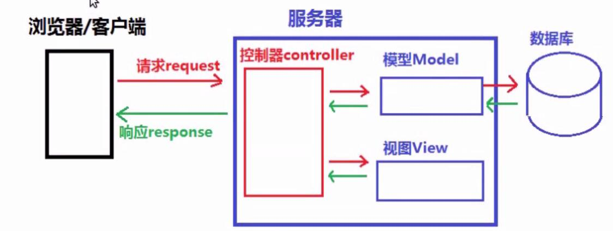
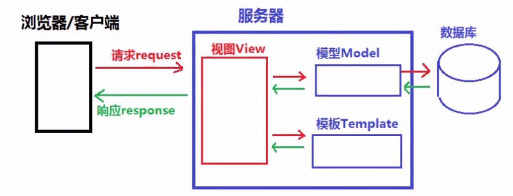
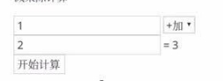
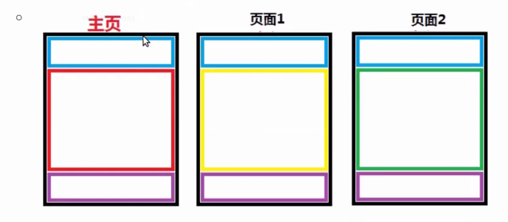

# POST传递参数
* 客户端通过表单等POST请求将数据传递给服务器端，如：
```html
<form method="post" action="/user/login">
    姓名:<input type="text" name="username">
</form>
```
* 服务器端接收参数
    * 通过request.method来判断是否为POST请求，如:
    ```
    if request.method == 'POST':
        处理POST请求的数据并响应
    else:
        处理非POST请求并响应
    ```
* 使用post方式接收客户端数据
    1. 方法
    ```
    request.POST['参数名'] # request.POST 绑定QueryDict
    request.POST.get('参数名','')
    request.POST.getlist('参数名')
    ```
* 取消csrf验证，否则Django将会拒绝客户端发来的POST请求
    * 取消csrf验证
        * 删除settings.py中MIDDLEWARE中的CsrfViewsMiddleWare的中间件
        ```
        MIDDLEWARE = [
            ...
            # 'django.middleware.csrf.CsrfViewMiddleware',
            ...
        ]
        ```
# from 表单的name属性
* 在form控件提交数据时，会自动搜索本表单控件内部的子标签的name属性及相应的值，再将这些名字和值以键-值对的形式提交给action指定的服务器相关位置
* 在form内能自动搜集到的name属性的标签控件有
    ```html
    <input name="xxx">
    <select name="yyy"></select>
    <textarea name="zzz"></textarea>
    ```
    * 如:
    ```html
    <form action="/page1" method="post">
      <input name="title" type="text" value="输入">
      <select name="gender">
          <option value="1">男</option>
          <option value="0">女</option>
      </select>
      <textarea name="comment"cols="5" rows="10">附言...</textarea>
      <input type="submit" value="提交">
    </form>
    ```
# Django的框架设计模式
* MVC设计模式
    * MVC代表Model-View-Controller(模型-视图-控制器)模式。
    * 作用:降低模块间的耦合度(解耦)
    * MVC
        * M 模型层(Model),主要用于对数据库层的封装
        * V 视图层(View),用于向用户展示结果
        * C 控制(Controller,用于处理请求、获取数据、返回结果(重要))
    * MVC模式如图:
        
* MTV模式
MTV代表Model-Template-View(模型-模板-视图)模式。这种模式用于应用程序的分层开发
    * 作用：
        * 降低模块间的耦合度(解耦)
    * MTV
        * M -- 模型层(Model)负责与数据库交互       
        * T -- 模板层(Template)负责呈现内容到浏览器
        * V -- 视图层(View)是核心，负责接收请求、获取数据、返回结果
    * MTV模式如图:
        
# 模板 Templates
* 什么是模板
    1. 模板是可以根据字典数据动态变化的html网页
    2. 模板可以根据视图中传递的字典数据动态生成对应的HTML网页
* 模板的配置
    * 创建模板文件夹<项目名>/templates
    * 在settings.py中有一个TEMPLATES变量
        1. BACKEND:指定模板的引擎
        2. DIRS:模板的搜索目录(可以是一个或多个)
        3. APP_DIRS:是否要在应用中的templates文件夹中搜索模板文件
        4. OPTIONS:有关模板的选项
    * 默认的模块文件夹templates
    * 修改settings.py文件，设置SEMPLATES的DIRS值为'DIRS'
      [os.path.join(BASE_DIR,'templates')],
    ```
    # file:settings.py
    TEMPLES = [
        {
            'BACKEND':'django.template.backends.django.DjangoTemplates',
            # 'DIRS':[],     
            'DIRS':[os.path.join(BASE_DIR,'templates')], # 添加模板路径
            'APP_DIRS':True,    # 是否索引各app里的templates目录
            ...
        },
    ]
    ```
* 模板的加载方式
    1. 通过loader获取模板，通过HttpResponse进行响应
        ```
         from django.template import loader
         # 1. 通过loader加载模板
         t = loader.get_template("模板文件名")
         # 2. 将t转换成HTML字符串
         html = t.render("字典数据")
         # 3. 用响应对象将转换的字符串返回给浏览器
         return HttpResponse(html)
        ```
    2. 通过render()直接加载并响应模板
        ```
        from django.shortcuts import render
        return render(request,'模板文件名',字典数据)
        ```
# Django模板语言
## 模板的传参
* 模板传参是指把数据形成字典，传参给模板，为模板渲染提供数据
1. 使用loader加载模板
    ```
    t = loader.get_template('xxx.html')
    html = t.render(字典数据)
    return HttpResponse(html)
    ```
2. 使用render加载模板
    ```
    return render(request,'xxx.html',字典数据)
    ```
## 模板的变量
1. 在模板中使用变量语法
    * {{变量名}}
    * {{变量名.index}}
    * {{变量名.key}}
    * {{对象.方法}}
    * {{函数名}}
    1. 视图函数中必须将变量封装到字典中才允许传递到模板上
    ```
    def xxx_view(request):
        dic = [
            "变量1":"值1",
            "变量2":"值2",   
        ]
        return render(request,'xxx.html',dic)
    ```
* 练习
    * 写一个简单的计算器界面，能够在服务端进行简单加减乘除计算
    
    * 参考代码
    ```html
    <form action="/mycalc" method="post">
      <input type="text" name="x" value="1">
      <select name="op">
          <option value="add">+加</option>
          <option value="sub">-减</option>
          <option value="mul">*乘</option>
          <option value="div">/除</option>
      </select>
      <input type="text" name="y" value="2">=<span>3</span>
      <div>
          <input type="submit" value="开始计算">
      </div>
    </form>
    ```
## 模板的标签
1. 作用
    * 将一些服务端的功能嵌入到模板中
2. 标签语法
    ```
    
    ...
                  
    ```
3. if标签
    ```
    
    ...
    
    ...
    
    ...
    
    ...
    
    ```
4. if标签里的布尔运算符
    * if条件表达式里可以用的运算符==,!=,<,>,<=,>=,in,not in,is,is not,and,or
    * 在标记中使用实际括号是无效的语法，如果您需要他们指示优先级，则应使用嵌套的if标记
5. locals函数的使用
locals()返回当前函数作用域内全部局部变量形成的字典
6. for标签
    1. 语法
        ```
        
            ... 循环语句
        
            ... 可迭代对象无数据时填充的语句
        
        ```
    2. 内置变量-forloop  
    
        |变量|描述|
        |----|----|
        |forloop.counter|循环的当前迭代(从1开始索引)|
        |forloop.counter0|循环的当前迭代(从0开始索引)|
        |forloop.revcounter|循环结束的迭代次数(从1开始索引)|
        |forloop.revcounter0|循环结束的迭代次数(从0开始索引)|
        |forloop.first|如果这是第一次通过循环，则为真|
        |forloop.last|如果这是最后一次循环，则为真|
        |forloop.parentloop|当嵌套循环，parentloop表示外层循环|
## 过滤器
1. 作用
    * 在变量输出时对变量的值进行处理
    * 您可以通过使用过滤器来改变变量的输出的显示
2. 语法
    * {{变量|过滤器1:参数值1|过滤器2:参数值2...}}
3. 常用过滤器
    
    |过滤器|说明|
    |-----|----|
    |lower|将字符串转换为全部小写|
    |upper|将字符串转换为全部大写|
    |safe|默认不对变量内的字符串进行html转义|
    |add:'n'|将value的值增加n|
    |truncatechars:'n'|如果字符串字符多于指定的字符数量，name会被截断。截断的字符串将以可翻译的省略号序列('...')结尾。|
4. 文档参见:
    * https://docs.djangoproject.com/en/3.0/ref/templates/builtins/
## 模板的继承
* 模板继承可以使父模板的内容重用，子模板直接继承父模板的全部内容并可以覆盖父模板中相应的块
* 定义父模板中的块block标签
    * 标识出那些在子模块中是允许被修改的
    * block标签:在父模板中定义，可以在子模板中覆盖
        ```
        
        定义模板块，此模板块可以被子模板重新定义的同名块覆盖
        
        ```
* 继承模板extends标签(写在模板文件的第一行)
    * 子模板继承语法标签
        * 
        * 如：
            * 
    * 子模板重写父模板中的内容块
        ```
        
        子模板块用来覆盖父模板中block_name块的内容
        
        ```
    * 重写的覆盖规则
        * 不重写，将按照父模板的效果显示
        * 重写，则按照重写的效果显示
    * 注意
        * 模板继承时，服务器端的动态内容无法继承
* 参考文档
* https://docs.djangoproject.com/en/3.0/ref/templates/
* 模板的继承示例:

## url反向解析
* url反向解析是指在视图或模板中，用为url定义的名称来查找或计算出相应的路由
* url函数的语法
    * url(regex,views,kwargs=None,name="别名")
    * 例如：
        url(r'user_login$',views.login_view,name="login")
* url()的name关键字参数
    * 作用:
        * 根据url列表中的name=关键字传参给url确定了个唯一确定的名字，在模板中，可以通过这个名字反向推断出此url信息
    * 在模板中通过别名实现地址的反向解析
        ```
        
        
        ```            
* 练习
    ```
    写一个有四个自定义页面的网站，分别对应路由
    /           主页
    /page1      页面1
    /page2      页面2
    /page3      页面3
    功能:是主页加三个页面的连接分别跳转到一个页面，三个页面每个页面加入一个连接用于返回主页
    ```
    
