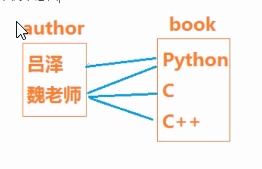
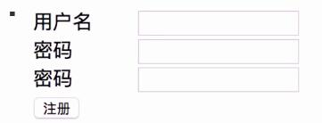

# admin后台数据库管理
* django提供了比较完善的后台管理数据库的接口,可供开发过程中调用和测试使用
* django会搜集所有已注册的模型类，为这些模型类提供数据管理界面，供开发者使用
* 使用步骤
    1. 创建后台管理账号
        * 后台管理--创建管理员账号
            * $ python3 manage.py createsuperuser
            * 根据提示完成注册，参考如下
                ```
                $ python3 manage.py createsuperuser
                 Username (leave blank to use 'dream'): dream # 此处输入用户名
                Email address:dong_1998_dream@163.com # 此处输入邮箱
                Password:# 此处输入密码(密码要复杂些,否则会提示密码太简单)
                Password(again):# 再输入重复密码
                Superuser created successfully
                $
                ```
    2. 用注册的账号登录后台管理界面
        * 后台管理的登录地址
            * http://127.0.0.1:8000/admin
# 自定义后台管理数据表
* 若要自己定义的模型类也能在/admin后台管理界面中显示和管理，需要将自己的类注册到后台管理界面
* 添加自己定义模型类的后台管理数据表的，需要用admin.site.register(自定义模型类)方法进行注册
    * 配置步骤如下:
        1. 在应用app的admin.py中导入注册要管理的模型models类，如:
            ```
            from . import models
            ```
        2. 调用admin.site.register方法进行注册，如
            ```
            from django.contrib import admin
            admin.site.register(自定义模型类)
            ```
    * 如：在bookstore/admin.py添加如下代码对Book类进行管理
        ```
        # file：bookstore/admin.py
        from django.contrib import admin
        # Register your models here
        from . import models
        ... 
        admin.site.register(models.Book)    # 将Book类注册为可管理页面
        ```
# 修改后台Models的展现方式
* 在admin后台管理数据库中对自定义的数据记录都展示为XXX object类型的记录，不便于阅读和判断
* 在用户自定义的模型类中可以重写def __str__(self): 方法解决显示问题，如:
    * 在自定义模型类中重写__str__(self)方法返回显示文字内容
    ```
    class Book(models.Model):
        ...
        def __str__(self):
            return "书名"+self.title 
    ```
# 模型管理类
* 作用
    * 为后台管理界面添加便于操作的新功能
* 说明
    * 后台管理器类需继承自django.contrib.admin里面的ModelAdmin类
* 模型管理器的使用方法:
    1. 在<应用app>/admin.py里定义模型管理器类
        ```
        class xxx_Manager(admin.ModelAdmin):
            ...
        ```
    2. 注册管理器与模型类关联
        ```
        from django.contrib import admin
        from . import models
        admin.site.register(model.YYYY,XXXX_Manager)    # 注册models.YYYY 模型类与管理器类XXXX_Manager关联
        ```
    * 示例
        ```
        # file: bookstore/admin.py
        from django.contrib import admin
        class BookAdmin(admin.ModelAdmin):
            list_display = ['id','title','price','market_price']  
        admin.site.register(models.Book,BookAdmin)
        ```
    * 进入http://127.0.0.1:8000/admin/bookstore/book查看显示方式和以前有所不同
* 模型管理器类ModelAdmin中实现的高级管理功能
    1. list_display去控制哪些字段会显示在Admin的修改列表页面中
    2. list_display_links可以控制list_display中的字段是否应该连接到对象的"更改"页面。
    3. list_filter设置激活Admin修改列表页面右侧栏的过滤器
    4. search_fields设置启用Admin更改列表页面的搜索框
    5. list_editable设置为模型上的字段名称列表，这将允许在更改列表页面上进行编辑
    6. 其他参见https://docs.djangoproject.com/en/3.0/ref/contrib/admin/
# 数据表管理
1. 修改模型类字段的显示名字
    * 模型类各字段的第一个参数为verbose_name，此字段显示的名称会在后台数据库管理页面显示
    * 通过verbose_name字段选项，修改显示名称示例如下：
        ```
        title = models.CharField(
            max_length = 30,
            verbose_name = '显示名称'
        )
        ```
2. 通过Meta内嵌类定义模型类的属性及展现形式
    * 模型类可以通过内部类classMeta来重新定义当前模型类和数据表的一些属性信息
    * 用法格式如下
        ```
        class Book(model,Model):
            title = CharField(...)
            class Meta:
                1. db_table = '数据表名'
                    该模型所有的数据表的名称(设置完成后需要立马更新同步数据库)
                2. verbose_name = '单数名'
                    给模型对象的一个易于理解的名称(单数),用于显示在/admin管理界面中
                3. verbose_name_plural = '复数名'
                    该对象复数形式的名称(复数)，用于显示在/admin管理界面中
        ```
    * 练习
        * 将Book模型类和Author模型类都加入后台管理
        * 制作一个AuthorManager管理器类，让后台管理Authors列表中显示作者的ID、姓名、年龄信息
        * 用后台管理程序添加三条Author记录
        * 修改其中一条记录的年龄
        * 删除最后一条添加的记录
        * 将bookstore_author改为myauthor(需要重新迁移数据库)
# 数据表关联关系映射
* 在关系型数据库中，通常不会把所有数据都放在同一张表中，这样做会额外占用内存空间
* 在关系型数据库中通常用表关联来解决数据库
* 通常的表关联方式有三种：
    1. 一对一映射
        * 如：一个身份证号码对应一个人
    2. 一对多映射
        * 如：一个班级可以有多个学生
    3. 多对多映射
        * 如：一个学生可以报多门课程，一个课程可以有多个学生学习
## 一对一映射
 * 一对一是表示现实事物间存在的一对一的对应关系
 * 如：一个家庭只有一个户主，一个男人有一个妻子，一个人有一个唯一的指纹信息等
 1. 语法
    ```
    class A(models.Model):
        ...
    class B(models.Model):
        属性 = models.OneToOneField(A)
    ```
 2. 用法示例
    1. 创建作家和作家妻子类
        ```
        # file: xxx/models.py
        from django.db import models
        class Author(models.Model):
            '''作家模型类'''
            name = models.CharField('作家',max_length=50)
        class Wife(models.Model):
            '''作家妻子模型类'''
            name = models.CharField('妻子',max_length=50)
            author = models.OneToOneField(Author)   # 增加一对一属性
        ```
    2. 查询
        * 在Wife对象中，通过author属性找到对应的author对象
        * 在Author对象中，通过wife属性找到对应的wife对象
    3. 创建一对一的数据记录
        ```
        from . import models
        author1 = models.Author.objects.create(name='张老师')
        wife = models.Wife.objects.create(name='王夫人',author=author1 # 关联王老师)
        
        author2 = models.Author.objects.create(name='小泽老师') # 一对一可以没有数据对应的数据
        ```
    4. 一对一数据的相互获取
        1. 正向查询
            * 直接通过关联属性查询即可
            ```
            # 通过wife找author
            from . import models
            wife = models.Wife.objects.get(name='张夫人')
            print(wife.name,'的老公是',wife.author.name)
            ```
        2. 反向查询
            * 通过反向关联属性查询
            * 反向关联属性为示例对象，引用类名(小写)，如作家的反向引用为作家对象.wife
            * 当反向引用不存在时，则会触发异常
                ```
                # 通过author.wife关联属性找wife,如果没有对应的wife，则触发异常
                author1 = models.Author.objects.get(name='王老师')
                print(author1.name,'的妻子是',author1.wife.name)
                author2 = models.Author.objects.get(name='小泽老师')
                try:
                    print(author2.name,'的妻子是',author2.wife.name)
                except:
                    print(author2.name,'还没有妻子')
                ```
* 作用
    * 主要是解决常用数据不常用数据的存储问题，把经常加载的一个数据放在主表中，不常用的数据放在另一个副表中，这样在访问主表数据时不需要加载副表中的数据以提高访问速度提高效率和节省内存空间，如经常把书的内容和书名建成两张表，因为在网站上经常访问书名等信息，但不需要得到书的内容。
* 练习
    1. 创建一个Wife模型类，属性如下
        1. name
        2. age
    2. 在Wife类中增加一对一关联关系，引用Author
    3. 同步回数据库并观察结果
## 一对多映射
* 一对多是表示现实事物间存在的一对多的对应关系
* 如：一个学校有多个班级，一个班级有多个学生，一本图书只能属于一个出版社，一个出版社允许出版多本图书
1. 用法语法
    * 当一个A类对象可以关联多个B类对象时
        ```
        class A(models.Model):
            ...
        class B(models.Model):
            属性 = models.ForeignKey(多对一中"一"的模型类,...)
        ```
2. 外键类ForeignKey
    * 构造函数
        ForeignKey(to,on_delete,**options)
    * 常用参数
        * on_delete
            1. models.CASCADE级联删除。Django模拟SQL约束ON DELETE CASCADE的行为，并删除包含ForeignKey的对象
            2. models.PROTECT抛出ProtectedError以阻止被引用对象的删除
            3. SET_NULL设置ForeignKey null;只有null是True才有可能
            4. SET_DEFAULT将ForeignKey设置为其默认值；必须设置ForeignKey的默认值
            5. 其他请参考文档
                * https://docs.djangoproject.com/en/3.0/ref/models/fields/foreignkey ForeignKey部分
        * **options可以是常用的字段选项如:
            1. null
            2. unique等
            3. ...
3. 示例
    * 有两个出版社对应五本书的情况
        1. 清华大学出版社 有书
            1. C++
            2. Java
            3. Python
        2. 北京大学出版社 有书
            1. 西游记
            2. 水浒传
    1. 定义一对多类
        ```
        # file: one2many/models.py
        from django.db import models
        class Publisher(models.Model):
            '''出版社'''
            name = models.CharField('名称',max_length=50,unique=True)
        class Book(models.Model):
            title = models.CharField('书名',max_length=50)
            publisher = models.ForeignKey(Publisher,null=True)
        ```
    * 创建一对多的对象
        ```
        # file:xxx/views.py
        from . import models
        pub1 = models.Publisher.objects.create(name='清华大学出版社')
        models.Book.objects.create(title='C++',publisher=pub1)
        models.Book.objects.create(title='Java',publisher=pub1)
        models.Book.objects.create(title='Python',publisher=pub1)
        pub2 = models.Publisher.objects.create(name='北京大学出版社')
        models.Book.objects.create(title='西游记',publisher=pub2)
        models.Book.objects.create(title='水浒传',publisher=pub2)   
        ```
    * 查询
        * 通过多查一
            ```
            # 通过一本书找到对应的出版社
            book = models.Book.objects.get(id=1)
            print(book.title,'的出版社是:',book.publisher.name)
            ```
        * 通过一查多
            ```
            # 通过出版社查询对应的书
            pub1 = models.Publisher.objects.get(name='清华大学出版社')
            books = pub1.book_set.all() # 通过book_set获取pub1对应的多个Book数据对象
            # books = models.Book.objects.filter(publisher=pub1) # 也可以采用此方式获取
            print("清华大学出版社的书有:")
            for book in books:
                print(book.title)
            ```     
* 练习
    1. 完成Book和Publisher之间的一对多
    2. 查看数据库效果
    3. 登录到后台查看Book实体
3. 数据查询
    1. 通过Book查询Publisher
        ```
        通过publisher属性查询即可
        练习
            查询西游记对应的出版社信息，打印在终端上
        ```
    2. 通过Publisher查询对应的所有的Books
        ```
        Django会在Publisher中增加一个属性来表示对对应的Book们的查询引用属性:book_set(MyModel.objects)   
        ```
## 多对多映射
* 多对多表达对象之间多对多复杂关系，如:每个人都有不同的学校(小学，初中，高中，大学)，每个学校有不同的学生
1. 语法
    * 在关联的两个类中的任意一个类中，增加：
        * 属性 = models.ManyToManyField(MyModel)
2. 示例
    * 一个作者可以出版多本书
    * 一本图书可以被多名作者同时编写
        ```
        class Author(models.Model):
            ...
        class Book(models.Model):
            ...
            authors = models.ManyToManyField(Author)
        ```
3. 数据查询
    1. 通过Book查询对应的所有的Authors
        ```
        book.authors.all()  --> 获取book对应的所有的author的信息
        book.authors.filter(age__gt=80) --> 获取book对应的作者中年龄大于80岁的作者的信息
        ``` 
    2. 通过Author查询对应的所有的Books
        * Django会生成一个关联属性book_set用于表示对应的book的查询对象相关操作
            ```
            author.book_set.all()
            author.book_set.filter()
            author.book_set.create(...) # 创建新书并关联作用author
            author.book_set.add(book)   # 添加已有的书为当前作者author
            author.book_set.clear()     # 删除author所有关联的书
            author.book_set.remove()    # 删除所有author所有关联的书
            ```
4. 示例
    * 多对多模型
        ```
        class Author(models.Model):
            '''作家模型'''
            name = models.CharField('作家',max_length=50)
            def __str__(self):
                return self.name
        class Book(models,Model):
            title = models.CharField('书名',max_length=50)
            author = models.ManyToManyField(Author,null=True)
            def __str__(self):
                return self.title
        ```
    * 多对多视图操作
        ```
        from django.http import HttpResponse
        from . import models
        def many2many_init(request):
            # 创建两个作者
            author1 = models.Author.objects.create(name='吕泽')
            author2 = models.Author.objects.create(name='魏老师')
            # 吕泽和魏老师同时写了一本Python
            book11 = author1.book_set.create(title='Python')
            author2.book_set.add(book11)
            # 魏老师还写了两本书
            book21 = author2.book_set.create(title="C") # 创建一本新书"C"
            book22 = author2.book_set.create(title="C++") # 创建一本新书"C++"
            return HttpResponse("初始化成功")
        
        
        def show_many2many(request):
            authors = models.Author.objects.all()
            for auth in authors:
                print("作者",auth_name,"出版了",auth.book_set.count(),"本书:")
                for book in books:
                    print('      ',book.title)
            print("-----显示书和作者的关系-------")
            books = models.Book.objects.all()
            for book in books:
                auths = book.author.all()
                print(book.title,'的作者是:','、'.join([str(x.name) for x in auths]))
            return HttpResponse("显示成功，请查看服务器端控制台终端")  
        ```
    * 多对多最终的SQL结果
        ```
        mysql>select * from many2many_author;
        +----+-----------+
        | id | name      |
        +----+-----------+
        | 11 | 吕泽      |
        | 12 | 魏老师    |
        +----+-----------+
        2 rows in set (0.00 sec)
        
        mysql>select * from many2many_book;
        +----+-----------+
        | id | title     |
        +----+-----------+
        | 13 | Python    |
        | 14 | C         |
        | 15 | C++       |  
        +----+-----------+
        3 rows in set (0.00 sec)
        
        mysql> select * from many2many_book_author;
        +----+-----------+-------------+
        | id | book_id   |   author_id |
        +----+-----------+-------------+
        | 13 |      13   |          11 |
        | 20 |      13   |          12 |
        | 18 |      14   |          12 |
        | 19 |      15   |          12 |
        +----+-----------+-------------+
        4 rows in set (0.00 sec)
        ```
        * 示例示意图
        
# cookies和session
## cookies
* cookies是保存在客户端浏览器上的存储空间，通常用来记录浏览器端自己的信息和当前连接的确认信息
* cookies在浏览器上是以键-值对的形式进行存储的，键和值都是以ASCII字符串的形式存储(不能是中文字符串)
* cookies的内部的数据会在每次访问此网址时都会携带到服务器端，如果cookies过大会降低响应速度
* 在Django服务器端来设置，设置浏览器的COOKIE必须通过HttpResponse对象来完成
* HttpResponse关于COOKIE的方法
    * 添加、修改COOKIE
        * HttpResponse.set_cookie(key,value='',max_age=None,expires=None)
            * key:cookie的名字
            * value:cookie的值
            * max_age:cookie存活时间 秒为单位
            * expires:具体过期时间
            * 当不指定max_age和expires时，关闭浏览器时此数据失效
    * 删除COOKIE
        * HttpResponse.delete_cookie(key)
        * 删除指定的key的Cookie,如果key不存在则什么也不发生
* Django中的cookies
    * 使用响应对象HttpResponse等将cookie保存进客户端
        1. 方法一
            ```
            from django.http import HttpResponse
            response = HttpResponse()
            response.set_cookie('cookie名',cookies值,超期时间)
            ```
            * 如
               ```
               response = HttpResponse()
               response.set_cookie('myvar','dream',超期时间)
               ```
        2. 方法二：使用render对象
            ```
            from django.shortcuts import render
            response = render(request,'xxx.html',locals())
            response.set_cookie('cookies名',cookies值，超期时间)  
            ```
    * 获取cookie
        * 通过request.COOKIES绑定的字典(dict)获取客户端的COOKIES数据
            ```
            value = request.COOKIES.get('cookies名','没有值')
            print("cookies名",value)
            ```
    * 注
        * chrome浏览器可以通过开发者工具的Application
        Storage>>Cookies 查看和操作浏览器所有的Cookies值
* cookies示例
    * 一下示例均在视图函数中调用
    * 添加cookies
        ```
        # 为浏览器添加键为my_var1,值为123,过期时间为1小时的cookie
        response = HttpResponse("已添加my_var1,值为123")
        response.set_cookie('my_var1',123,3600)
        return response
        ```
    * 修改cookie
        ```
        # 为浏览器添加键为myvar1,修改值为456,过期时间为2个小时的cookie
        response = HttpResponse("已修改my_var1,值为456")
        response.set_cookie('my_var1',456,3600*2)
        return response
        ```
    * 删除cookie
        ```
        # 删除浏览器键为my_var1的cookie
        response = HttpResponse("已删除my_var1")
        response.delete_cookie('my_var1')
        return response
        ```
    * 获取cookie
        ```
        # 获取浏览器中my_var变量对应的值
        value = request.COOKIES.get('my_var','没有值！')
        print("cookie my_var = ",value)
        return HttpResponse("my_var:"+value)
        ```
* 综合练习
    * 实现用户注册功能，界面如下
        * 注册界面
        
    * 要求
        1. 创建一个user应用，实现注册逻辑，如:
            * python3 manage.py startapp user
        2. 如果用户注册成功，则用当前浏览器的cookies记录当前成功注册的用户名
        3. 注册时如果用户输入数据合法，则在数据库中记录用户的用户名密码等数据
    * 模型类
        1. 用户模型类
            ```
            class User(models.Model):
                username = models.CharField("用户名",max_length=30,unique=True)
                password = models.CharField("密码",max_length=30)
                def __str__(self):
                    return "用户"+self.username
            ```
    * 登录设计规范(在user应用中写代码)  
    
    |路由正则|视图函数|模板位置|说明|
    |-------|-------|-------|----|
    |/user/reg|def reg_view(request):|templates/user/register|用户注册|
# session会话控制
        
    
