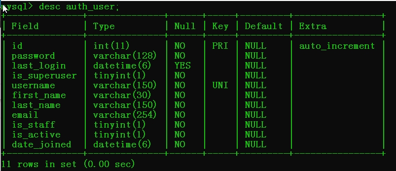

# Django中的用户认证(使用Django认证系统)
* Django带有一个用户认证系统。它处理用户账号，组，权限以及基于cookie的用户会话
* 作用：   
    1. 添加普通用户和超级用户
    2. 修改密码
* 文档参见
    * https://docs.djangoproject.com/en/3.0/topics/auth/
* User模型类
    * 位置:from django.contrib.auth.models import User
* 默认user的基本属性有：

|属性名|类型|是否必选|
|-----|----|-------|
|username|用户名|是|
|password|密码|是|
|email|邮箱|可选|
|first_name|名||
|last_name|姓||
|is_superuser|是否是管理员账号(/admin)||
|is_staff|是否可以访问admin管理界面||
|is_active|是否是活跃用户，默认True,一般不会删除用户，而是将用户的is_active设为False||
|last_login|上一次登录时间||
|date_joined|用户创建时间||
* 数据库表现形式

## auth基本模型操作
* 创建用户
    * 创建普通用户create_user
        ```
        from django.contrib.auth import models
        user = models.User.objects.create_user(username='用户名',password='密码',email='邮箱',...)
        ...
        user.save()
        ```
    * 创建超级用户create_superuser
        ```
        from django.contrib.auth import models
        user = models.User.objects.create_superuser(username='用户名',password='密码',email='邮箱',...)
        ...
        user.save()
        ```
    * 删除用户
        ```
        from django.contrib.auth import models
        try:
            user = models.User.objects.get(username='用户名')
            user.is_active = False # 当前用户无效
            user.save()
            print("删除普通用户成功")
        except:
            print("删除普通用户失败")
        return HttpResponseRedirect('/user/info')
        ```
    * 修改密码
        ```
        from django.contrib.auth import models
        try:
            user = models.User.objects.get(username='donghaodong')
            user.set_password('584023982')
            user.save()
            return HttpResponse("修改密码成功")
        except:
            return HttpResponse("修改密码失败")
        ```
    * 检查密码是否正确check_password
        ```
        from django.contrib.auth import models
        try:
            user = models.User.objects.get(username='用户名')
            if user.check_password('584023982'): # 成功返回True失败返回False
                return HttpResponse("密码正确")
            else:
                return HttpResponse("密码错误")
        except:
            return HttpResponse('没有此用户')
        ```
# 项目部署
* 项目部署是指在软件开发完毕后，将开发机器上运行的开发版软件实际安装到服务器上进行长期运行
* 部署要分为一下几个步骤进行
    1. 在安装机器上安装和配置同版本的数据库
    2. django项目迁移(在安装机器上配置与开发环境相同的python版本及依赖的包)
    3. 用uwsgi替代盘python3 manage.py runserver 方法启动服务器
    4. 配置nginx反向代理服务器
    5. 用nginx配置静态文件路径，解决静态路径问题
1. 安装同版本的数据库
    * 安装步骤略
2. django项目迁移
    1. 安装python
        * $ sudo apt install python3
    2. 安装相同版本的包
        * 导出当前模块数据包的信息
            * $ pip3 freeze > package_list.txt
        * 导入到另一台新主机
            * $ pip3 install -r package_list.txt
    3. 将当前项目源代码复制到远程主机上(scp命令)
        * $ sudo scp -a 当前项目源代码远程主机地址和文件夹
        * $ sodu scp -a /home/tarena/django/mysite6 root@127.0.0.1:/home/root/xxx
# WSGI Django工作环境部署
* WSGI(Web Server Gateway Interface)Web服务器网关接口，是Python应用程序或框架和Web服务器之间的一种接口，被广泛使用
* 它实现了WSGI协议、http等协议。Nginx中httpUwsgiModule的作用是与uWSGI服务器进行交换。WSGI是一种Web网关接口
# uWSGI网关接口配置(ubuntu18.4配置)
* 使用python manage.py runserver通常只在开发和测试环境中使用
* 当开发结束后，完善的项目代码需要在一个高效稳定的环境中运行，这时可以使用uWSGI
*uWSGI是WSGI的一种，他可以让Django、Flask等开发的web站点运行其中
* 安装uWSGI
    * 在线安装uwsgi
    * 离线安装
        1. 在线下载安装包
            * $ pip3 download uwsgi
            * 下载后的文件为uwsgi-2.0.18.tar.gz
        2. 离线安装
            * $ tar -xzvf uwsgi-2.0.18.tar.gz
            * $ cd uwsgi-2.0.18
            * $ sudo python setup.py install
* 配置uWSGI
    * 添加配置文件 项目文件夹/uwsgi.ini
        * 如：mysite6/uwsgi.ini
            ```
            [uwsgi]
            # 套接字方式的IP地址:端口号
            # socket=127.0.0.1:8000
            # http通信方式的IP地址:端口号
            http=127.0.0.1:8000
            # 当前项目工作目录
            chdir=/home/tarena/mysite6 # 这里需要换为项目文件夹的绝对路径
            # 项目中的wsgi.py文件的目录相对于当前工作目录
            wsgi-file=mysite6/wsgi.py
            # 进程个数
            process = 4 
            # 每个进程线程个数
            threads = 2
            # 服务的ip记录文件
            pidfile=uwsgi.pid
            # 服务的日志文件位置
            daemonize=uwsgi.log
            ```
        * 修改settings.py将DEBUG=True改为DEBUG=False
        * 修改settings.py将ALLOWED_HOSTS=[]改为ALLOWED_HOSTS=['*']
* uWSGI的运行管理
    * 启动uwsgi
        ```
        $ cd 项目文件夹
        $ sudo uwsgi --ini 项目文件夹/uwsgi.ini
        ```
    * 停止uwsgi
        ```
        $ cd 项目文件夹
        $ sudo uwsgi --stop uwsgi.pid
        ```
    * 说明
        * 当uwsgi启动后，当前django项目的程序已变成后台守护进程，在关闭当前终端时此进程不会停止
* 测试
    * 在浏览器端输入http://127.0.0.1:8000进行测试
    * 注意，此时端口号是8000
# nginx反向代理配置
* Nginx是轻量级的高性能web服务器，提供了诸如HTTP代理和反向代理、负载均衡，缓存等一系列重要特性，在实践之中使用广泛

        
        
        
    
    


