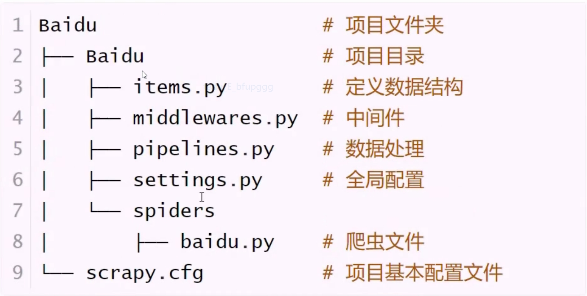

# Day12
## Day09回顾
## Scrapy框架
* 五大组件
```
引擎(Engine)
爬虫程序(Spider)
调度器(Scheduler)
下载器(Downloader)
管道文件(Pipeline)
# 两个中间件
下载器中间件(Downloader Middlewares)
蜘蛛中间件(Spider Middlewares)
```
* 工作流程
```
1. Engine向Spider索要URL，交给Scheduler入队列
2. Scheduler处理后出队列，通过Downloader Middlewares交给Downloader去下载
3. Downloader得到响应后,通过Spider Middleware交给Spider
4. Spider数据提取:
    1. 数据交给Pipeline处理
    2. 需要跟进URL，继续交给Scheduler入队列,依次循环
```
* 常用命令
```
# 创建爬虫项目
scrapy startproject 项目名
# 创建爬虫文件
cd 项目文件夹
scrapy genspider 爬虫名 域名
# 运行爬虫
scrapy crawl 爬虫名
```
* Scrapy目录结构  

* settings.py全局配置
```
1. USER_AGENT = 'Mozilla/5.0'
2. ROBOTSTXT_OBEY = False
3. CONCURRENT_REQUESTS = 32
4. DOWNLOAD_DELAY = 1
5. DEFAULT_REQUEST_HEADERS = {}
6. ITEM_PIPELINES={'项目目录名.piplines.类名':300}
```
## 创建项目流程
```
1. scrapy startproject Tencent
2. cd Tencent
3. scrapy genspider tencent tencent.com
4. items.py(定义爬取数据结构)
    import scrapy
    class TencentItem(scrapy.Item):
        job_name = scrapy.Field()
5. tencent.py(写爬虫文件)
    import scrapy
    class TencentSpider(scrapy.Spider):
        name = 'tencent'
        allowed_domains = ['tencent.com']
        start_urls = ['http://tencent.com/']
        def parse(self,response):
            pass
6. pipelines.py(数据处理)
    class TencentPipeline(object):
        def process_item(self,item,spider):
            return item
7. settings.py(全局配置)
ROBOTSTXT_OBEY = False
DEFAULT_REQUEST_HEADERS = {}
ITEM_PIPELINES = {'':200}
8. 终端:scrapy crawl tencent
```
## 响应对象属性及方法
```
# 属性
1. response.text :获取响应内容 - 字符串
2. response.body :获取bytes数据类型
3. response.xpath('')
# response.xpath('')调用方法
1. 结果:列表,元素为选择器对象
    # <selector xpath='//article' data=''>
2. .extract():提取文本内容,将列表中所有元素序列化为Unicode字符串
3. .extract_first():提取列表中第一个文本内容
4. .get():提取列表中第一个文本内容 
```
## 爬虫项目启动方式
* 方式一
```
从爬虫文件(spider)的start_urls变量中遍历URL地址
把下载器返回的响应对象(response)交给爬虫文件的parse()函数处理
# start_urls = ['http://www.baidu.com']
```
* 方式二
```
重写start_requests()方法,从此方法中获取URL，交给指定的callback解析函数处理
1. 去掉start_urls变量
2. def start_requests(self):
    # 生成要爬取的URL地址,利用scrapy.Request()
方法交给调度器
```
##日志级别
```
DEBUG < INFO < WARNING < ERROR < CRITICAL
```
## 数据持久化存储(MySQL、MongoDB)
```
1. 在settings.py中定义变量
2. pipelines.py中新建管道类，并导入settings模块
    def open_spider(self,spider):
        # 爬虫开始执行1次，用于数据连接
    def process_item(self,item,spider):
        # 用于处理抓取的item数据
    def close_spider(self,spider):
        # 爬虫结束时执行1次,用于断开数据库连接
3. settings.py中添加管道
    ITEM_PIPELINES = {'',300}
# :process_item()函数一定要return item 
```
## 保存为csv，json文件
* 命令格式
```
scrapy crawl maoyan -o maoyan.csv
scrapy crawl maoyan -o maoyan.json
# settings.py FEED_EXPORT_ENCODING = 'utf-8'
```
settings.py常用变量
```
# 1. 设置日志级别
LOG_LEVEL = ''
# 2. 保存到日志文件(不在终端输出)
LOG_FILE = ''
# 3. 设置数据导出编码(主要针对于json文件)
FEED_EXPORT_ENCODING = 'utf-8'
# 4. 非结构化数据存储路径
IMAGES_STORE = '路径'
# 5. 设置User-Agent
USER_AGENT = ''
# 6. 设置最大并发数(默认为16)
CONCURRENT_REQUESTS = 32
# 7. 下载延迟时间(每隔多久请求一个网页)
# DOWNLOAD_DELAY会影响CONCURRENT_REQUESTS,不能使并发显现
# 有CONCURRENT_REQUESTS,没有DOWNLOAD_DELAY:服务器会在同一时间收到大量的请求
# 有CONCURRENT_REQUESTS，有DOWNLOAD_DELAY时，服务器不会在同一时间收到大量请求
DOWNLOAD_DELAY = 3
# 8. 请求头
DEFAULT_REQUEST_HEADERS = {}
# 9. 添加项目管道
ITEM_PIPELINES = {}
# 10. 添加下载器中间件
DOWNLOADER_MIDDLEWARES = {}
```
## scrapy.Request()参数
```
1. url
2. callback
3. meta :传递数据,定义代理
```
Day13笔记
## 作业详解-腾讯招聘
* 创建项目+爬虫文件
```
scrapy startproject Tencent
cd Tencent
scrapy genspider tencent hr.tencent.com
# 一级页面(postId)
https://careers.tencent.com/tencentcareer/api/post/Query?timestamp=1566266592644&countryId=&cityId=&bgIds=&productId=&categoryId=&parentCategoryId=&attrId=&keyword{}&pageIndex={}&pageSize=10&language=zh-cn&area=cn
# 二级页面
https://careers.tencent.com/tencentcareer/api/post/ByPostId?timestamp=1566266592644&postId={}&language=zh-cn
```
* 定义要抓取的数据结构
```
# 名称—+类别+职责+要求+地址+时间
job_name = scrapy.Field()
job_type = scrapy.Field()
job_duty = scrapy.Field()
job_require = scrapy.Field()
job_address = scrapy.Field()
job_time = scrapy.Field()
```
*
```
```
* 管道文件
```
create database tencentdb charset utf8;
use tencentdb
create table tencenttab(
    job_name varchar(500),
    job_type varchar(100),
    job_duty varchar(1000),
    job_require varchar(1000),
    job_address varchar(100),
    job_time varchar(100)
)charset=utf8;
```
**管道文件实现**
```
class TencentPipeline(object):
    def process_item(self,item,spider):
        print(dict(item))
        return item

import pymysql

class TencentMysqlPipeline(object):
    def open_spider(self,spider):
        self.db = pymysql.connect(
            '127.0.0.1','root','584023982','tencentdb',charset='utf8'
        )
        self.cursor = self.db.cursor()
    def process_item(self,item,spider):
        ins ='insert into tencenttab values(%s,%s,%s,%s,%s,%s)'
        L = [
            item['job_name'],
            item['job_type'],
            item['job_duty'],
            item['job_require'],
            item['job_address'],
            item['job_time']
        ]
        self.cursor.execute(ins,L)
        self.db.commit()
        return item
    def close_spider(self,spider):
        self.cursor.close()
        self.db.close()
```


