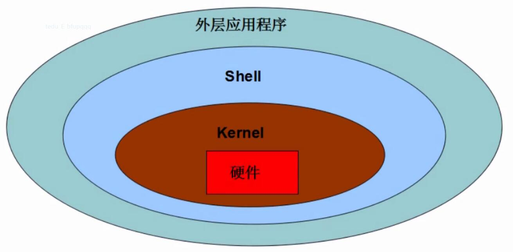
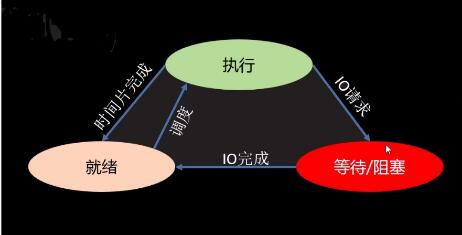
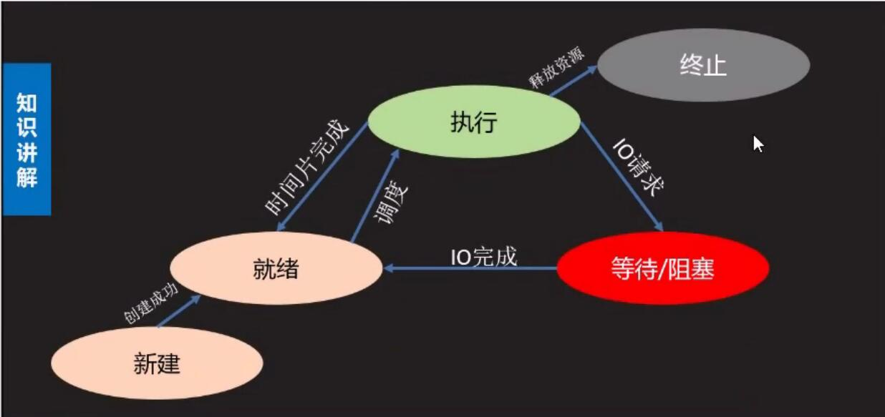

# 多任务编程
1.意义：充分利用计算机多核资源，提高程序运行效率。  
2.实现方案：多进程，多线程  
3.并行与并发
>并发：同时处理多个任务，内核在任务间不断切换达到好像多个任务同时执行的效果，实际每个时刻只有一个任务占有内核。  

>并行：多个任务利用计算机多核资源在同时执行，此时多个任务间为并行关系。
## 进程(process)
### 进程理论基础
1.定义：程序在计算机中的一次运行。
* 程序是一个可执行的文件，是静态的占有磁盘。
* 进程是一个动态的过程描述，占有计算机运行资源，有一定的生命周期。  

2.系统中如何产生一个进程
* 用户空间通过调用程序接口或者命令发起请求
* 操作系统接收用户请求，开始创建进程  
* 操作系统调配计算机资源，确定进程状态等
* 操作系统将创建的进程提供给用户使用  


3.进程基本概念
* cpu时间片：如果一个进程占有cpu内核则称为这个进程在cpu时间片上。
* PCB(进程控制块)：在内存中开辟的一块空间，用于存放进程的基本信息，也用于系统查找识别进程。
* 进程ID(PID)：系统为每个进程分配的一个大于0的整数，作为进程ID。每个 进程ID不重复。
     >Linux查看进程ID：ps -aux
* 父子进程：系统中每一个进程(除了系统初始化进程)都有唯一的父进程，可以有0个或多个子进程。父子进程关系便于进程管理。
>查看进程树：pstree
* 进程状态  
    * 三态  
        * 就绪态：进程具备执行条件，等待分配cpu资源
        * 运行态：进程占有cpu时间片正在运行
        * 进程暂时停止运行，让出cpu  
       
    * 五态(在三态的基础上增加新建和终止)


* 状态查看命令:ps -aux -->STAT列
>S 等待态  
R 执行态  
D 等待态  
T 等待态  
Z 僵尸  

> < 有较高优先级  
N 优先级较低  
\+ 前台进程  
s 会话组织长
l 有多线程的
* 进程运行特征
    * 进程可以使用计算机多核资源
    * 进程是计算机分配资源的最小单位  
    * 进程之间的运行互不影响，各自独立
    * 每个进程拥有独立的空间，各自使用自己空间资源  

>面试要求
>>1.什么是进程，进程和程序有什么区别  
>>2.进程有哪些状态，状态之间如何转化  
## 基于fork的多进程编程
### fork使用
**代码示例：day07/fork01.py**
```python
```
**代码示例：day07/fork02.py**
```python
```
>pid = os.fork()
功能：创建新的进程
返回值：整数，如果创建进程失败返回一个负数，如果成功则在原有进程中返回新进程的PID，在新进程中返回0

>注意
>>* 子进程会复制父进程的全部内存空间，从fork下一句开始执行。
>>* 父子进程各独立运行，运行顺序不一定。
>>* 利用父子进程fork返回值的区别，配合if结构让父
