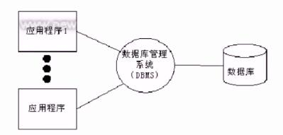
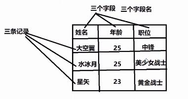

# 数据库概述
## 数据存储阶段
* 人工管理阶段
>缺点：数据无法共享，不能单独保持，数据存储量有限
* 文件管理阶段(.txt,.doc,.xls)
>优点：数据可以长期保存，可以存储大量的数据，使用简单  
缺点：数据一致性差，数据查找修改不方便，数据冗余度可能比较大
* 数据库管理阶段
>优点：数据组织结构化降低了冗余度，提高了增删改查的效率，容易扩展，方便程序调用，做自动化处理。  
缺点：需要使用sql或者其他特定的语句，相对比较复杂  
## 数据库应用
>金融机构、游戏网站、购物网站、论坛网站......

## 基础概念
>数据：能够输入到计算机中并被识别处理的信息集合

>数据结构：研究一个数据集合中数据之间关系的

>数据库，按照数据结构，存储管理数据的仓库。数据库是在数据库管理系统管理和控制下，在一定介质上的数据集合。

>数据库管理系统：管理数据库的软件，用于建立和维护数据库。

>数据库系统：有数据库和数据库管理系统，开发工具等组成的集合
## 数据库分类和常见数据库  
* 关系型数据库和非关系型数据库
>关系型：采用关系模型(二维表)来组织数据结构的数据库

>非关系型：不采用关系模型组织数据结构的数据库

* 开源数据库和非开源数据库  
>开源：MySQL,SQLite,MongoDB

>非开源：Oracle、DB2、SQL_Server

* 常见关系型数据库
>MySQL,Oracle,SQL_Server、DB2,SQLite
## 认识关系型数据库和MySQL
1.数据库结构(图库结构)
>数据元素-->记录-->数据表-->数据库  


2.数据库概念解析
>数据表：存放数据的表格

>字段：每个列，用来表示该列数据的含义

>记录：每个行，表示一组完整的数据



3.MySQL特点
* 是开源数据库，使用C和C++编写
* 能够工作在众多不同的平台上
* 提供了用于C、C++、Python、Java、Perl、PHP、Ruby众多语言的API
* 存储结构优良，运行速度快
* 功能全面丰富

4.MySQL安装
>Ubuntu安装MySQL服务
>>安装服务端：sudo apt-get install mysql-server
>>安装客户端：sudo apt-get install mysql-client
>>>配置文件：/etc/mysql
>>>命令集：/usr/bin
>>>数据库存储目录：/var/lib/mysql

>Windows安装MySQL
>>下载MySQL安装包(Windows)
>>https://dev.mysql.com/downloads/mysql/
>>mysql-installer\*\*\*5.7.\*\*\*.msi   
>
>>安装教程去安装

5.启动和连接MySQL服务
>服务端启动
>>查看MySQL状态：sudo /etc/init.d/mysql status  
>>启动服务：sudo /etc/init.d/mysql start|stop|restart  

>客户端连接
>>命令格式
>>>mysql -h主机地址 -u 用户名 -p密码
>>>mysql -hlocalhost -uroot -p123456
>>>本地连接可省略-h选项:mysql -uroot -p123456

>关闭连接
>> ctrl-D
>> exit  
# SQL语句
>什么是SQL
>>结构化查询语言(Structured Query Language),一种特殊目的的编程语言，是一种数据库查询和程序设计语言，用于存取数据以及查询、更新和管理关系数据库系统。

>SQL语句使用特点  
>* SQL语言基本上独立于数据库本身 
>* 各种不同的数据库对SQL语言的支持与标准存在细微的不同  
>* 每条命令必须以;结尾  
>* SQL命令关键字不区分大小写  
# MySQL数据库操作
## 数据库操作
1.查看已有库
>show databases;

2.创建数据库(指定字符集)
>create database 数据库名[character set utf8];
```SQL
创建student数据库，编码为utf8
create database student character set utf8;
create database student charset = utf8;
```
3.查看创建数据库的语句(字符集)
>show create database 库名;
```SQL
查看student创建方法
show create database student;
```
4.查看当前所在库
>select database();

5.切换库
>use 库名;
```SQL
使用Student数据库
use Student;
```
6.删除库
>drop database 库名;
```SQL
删除数据库test
drop database test;
```
7.数据库命名规则
>* 数字、字母、下划线，但不能使用纯数字
>* 库名区分大小写
>* 不能使用特殊字符和mysql关键字  

## 数据表的管理
1.表结构设计初步
* 分析存储内容
* 确定字段组成
* 设计字段类型

2.数据类型支持
>数字类型
>>整数类型(精确值)： INTEGER ,INT,SMALLINT,TINYINT,MEDIUMINT,BIGINT  
>>定点类型(精确值)-DECIMAL  
>>浮点类型(近似值)-FLOAT、DOUBLE  
>>比特值类型-BIT

|类型|大小|范围(有符号)|范围(无符号)|用法|
|----|----|----------|------------|----|
|TINYINT|1字节|(-128,127)|(0,255)|小整数值|
|SMALLINT|2字节|(-32768,32767)|(0,65535)|大整数值|
|MEDIUMINT|3字节|(-8388608,8388607)|(0,16777215)|大整数值|
|INT或INTEGER|4字节|(-2147483648,2147483647)|(0,4294967295)|大整数值|
|BIGINT|8字节|(-9223372036854775808,9223372036854775807)|(0,18446744073709551615)|极大整数值|
|FLOAT|4字节|(-3.402823466E+38,-1.175494351E-38),0,(1.175494351E-38,3.402823466351E+38)|0,(1.175494351E-38,3.402823466E+38)|单精度浮点数值|
|DOUBLE|8字节|(-1.7976931348623157E+308,-2.2250738585072014E-308),0,(2.250738585072014E-308,1.7976931348623157E+308)|(0,2.2250738585072014E-308,1.7976931348623157E+308)|双精度浮点数值|
|DECIMAL|对DECIMAL(M,D)|依赖于M和D的值|依赖于M和D的值|小数值|
>对于精度比较高的东西，比如money,用decimal类型提高精度减少误差。列的声明语法是DECIMAL(M,D)。
>>M是数字的最大位数(精度)。其范围为1-65,M的默认值是10。  
>>D是小数点右侧数字的数目(标度)。其范围是0-30,但不得超过M。  
>>比如DECIMAL(6,2)最多存6位数字，小数点后占2位。取值范围-9999.99到9999.99。

>比特值类型0,1值表达两种情况，如真，假。

>字符串类型
>>CHAR和VARCHAR类型
>>BINARY和VARBINARY类型
>>BLOB和TEXT类型
>>ENUM类型和SET类型

|类型|大小|用途|
|----|----|----|
|CHAR|0-255字节|定长字符串|
|VARCHAR|0-65535字节|变长字符串|
|TINYBLOB|0-255字节|不超过255个字符的二进制字符串|
|TINYTEXT|0-255字节|短文本字符串|
|BLOB|0-65535|二进制形式的长文本数据|
|TEXT|0-65535字节|长文本数据|
|MEDIUMBLOB|0-16777125字节|二进制形式的中等长度文本数据|
|MEDIUMTEXT|0-16777125字节|中等长度文本数据|
|LONGBLOB|0-4294967295字节|二进制形式的极大文本数据|
|LONGTEXT|0-4294967295字节|极大文本数据|
* char和varchar
>char：定长，效率高，一般用于固定长度的表单提交数据存储，默认1字符    
>varchar：不定长，效率偏低

* text和blob
>text用来存储非二进制文本  
>blob用来存储二进制字节串  
* enum和set
>enum用来存储给出一个值  
>set用来存储给出的值中一个或多个值  

1.表的基本操作
>创建表(指定字符集)  
>>create table 表名(  
>>字段名 数据类型,  
>>字段名 数据类型,  
>>......  
>>字段名 数据类型
);

>>* 如果你想设置数字为无符号则加上-unsigned
>>* 如果你不想字段为NULL可以设置字段属性为NOT NULL,在操作数据库时如果输入该字段的数据为NULL，就会报错。
>>* DEFAULT表示设置一个字段的默认值  
>>* AUTO_INCREMENT定义列为自增属性，一般用于主键，数值会自动加1。
>>* PRIMARY KEY关键字用于定义列为主键。主键的值不能重复。
```SQL
创建班级表
create table Student_Class(
    id int primary key auto_increment,
    Student_Name varchar(32) not null,
    age int unsigned not null,
    sex enum('W','M'),
    score FLOAT DEFAULT 0.0
);
创建兴趣班表
create table Interest_Class(
    id int primary key auto_increment,
    Class_Name varchar(32) not null,
    hobby set('sing','dance','draw'),
    price decimal(7,2),
    level char not null,
    comment text
);
```
>查看数据表
>>show tables;

>查看已有表的字符集
>>show create table 表名;

>查看表结构
>>desc 表名;

>删除表
>>drop table 表名;
# 数据的基本操作
## 插入(insert)
```
insert into 表名 values(值1),(值2),(值3),...;
insert into 表名(字段1,,字段2,字段3,...) values(值1),(值2),(值3),...;
```
```SQL
insert into Student_Class values(6,'YangYueYue',22,'W',80.5),(7,'LiuTian',23,'W',95.8),(8,'NiPanPan',22,'M',88.5),(9,'WangZhen',23,'M',85.9);
insert into Student_Class (Student_Name,age,sex) values('XueChen',21,'M');
insert into Interest_Class values(1,'DongHaoDong','sing,draw',16800,'B','表现良好，进步很大'),(2,'ChenHuan','draw,dance',15800,'A','很有天赋，继续加油'),(3,'LiuFan','sing,dance',19600,'A','太棒了,继续加油'),(4,'ZhangLeLe','draw,sing,dance',25800,'C','还需努力，继续加油'),(5,'XueChen','draw,dance',14560,'B','真棒，你真厉害');
```
## 查询(select)
```
select * from 表名 [where 条件];

select 字段1,字段2 from 表名 [where 条件];
```
```SQL
select * from Student_Class;

select Student_Name,age from Student_Class;
```
## where子句
where子句在sql语句中扮演了重要角色，主要通过一定的运算条件进行数据的筛选  
MySQL主要有以下几种运算符
>算数运算符  
>比较运算符  
>逻辑运算符  
>位运算符  
### 算数运算符
|运算符|作用|
|------|----|
|+|加法|
|-|减法|
|*|乘法|
|/ 或 DIV|除法|
|% 或 MOD|取余|
```SQL
select * from Student_Class where age % 2 = 0;
```
### 比较运算符
|符号|概述|备注|
|----|----|----|
|=|等于||
|<>,!=|不等于||
|>|大于||
|<|小于||
|<=|小于等于||
|>=|大于等于||
|BETWEEN|在两值之间|>=min&&<=max|
|NOT BETWEEN|不在两值之间||
|IN|在集合中||
|NOT IN|不在集合中||
|<=>|严格比较两个NULL值是否相等|两个操作码均为NULL时，器所得值为1；而当一个操作码为NULL时，其所得值为0|
|LIKE|模糊匹配||
|REGEXP或RKIKE|正则式匹配||
|IS NULL|为空||
|IS NOT NULL|不为空||
```SQL
select * from Student_Class where in (21,23);
```
### 逻辑运算符
|运算符号|作用|
|-------|----|
|NOT 或者 !|逻辑非|
|AND|逻辑与|
|OR|逻辑或|
|XOR|逻辑异或|
```SQL
select * from Student_Class where sex = 'M' and age > 20;
```
### 位运算
|运算符号|作用|
|-------|----|
|&|按位与|
|\||按位或|
|^|按位异或|
|!|取反|
|<<|左移|
|>>|右移|
运算符优先级表
|优先级顺序|运算符|
|--------|-------|
|1|=|
|2|\|\|,OR,XOR|
|3|&&,AND|
|4|NOT|
|5|BETWEEN,CASE,WHEN,THEN,ELSE|
|6|=,<=>,>=,<=,<>,!=,IS,LIKE,REGEXP,IN|
|7|\||
|8|&|
|9|<<,>>|
|10|-,+|
|11|*,/,DIV,%,MOD|
|12|^|
|13|-(一元减号),~(一元比特反转)|
|14|！|
## 更新表记录(update)
>update 表名 set 字段1=值1,字段2=字段2,... where 条件;
```SQL
update Student_Class set age = 11 where Student_Name = 'DongHaoDong';
```
## 删除表记录(delete)
>delete from 表名 where 条件;  
注意:delete语句后如果不加where条件，所有记录全部清空
```SQL
delete from Student_Class where 'NingPanPan'; 
```
## 表字段操作(alter)
```
语法：alter table 表名 执行操作;
```
* 添加字段(add)  
alter table 表名 add 字段名 数据类型;  
alter table 表名 add 字段名 数据类型 frist;  
alter table 表名 add 字段名 数据类型 after 字段名;
* 删除字段(drop)  
alter table 表名 drop 字段名;
* 修改数据类型(modify)   
alter table 表名 modify 字段名 新数据类型;
* 修改字段名(change)
alter table 表名 change 旧字段名 新字段名 新数据类型;
* 表重命名(rename)
alter table 表名 rename 新表名;

```SQL
alter table interest add date Date after course;
```
## 时间类型数据
> 时间和日期类型
>>DATE,DATATIME和TIMESTAMP类型
>>TIME类型
>>年份类型YEAR

|类型|大小(字节)|范围|格式|用途|
|----|---------|----|--|----|
|DATE|3|1000-01-01/9999-12-31|YYYY-MM-DD|日期值|
|TIME|3|-838:59:59/838:59:59|HH:MM:SS|时间值或持续时间|
|YEAR|1|1901/2155|YYYY|年份值|
|DATETIME|8|1000-01-01 00:00:00/9999-12-31 23:59:59|YYYY-MM-DD HH:MM:SS|混合日期|
|TIMESTAMP|1970-01-01 00:00:00/2038结束时间是滴2147483647秒|，北京时间2038-1-19 11:14:07,格林尼治时间2038年1月 19日凌晨03:14:07|YYYYMMDD HHMMSS|混合日期和时间值，时间戳|
### 时间格式
>date:"YYYY-MM-DD"  
time:"HH:MM:SS"  
datetime:"YYYY-MM-DD HH:MM:SS"  
timestamp:"YYYY-MM-DD HH:MM:SS"  
注意
1.datatime：不给值默认返回NULL值
2.timestamp:不给值默认返回系统 当前时间  
### 日期时间函数
* now（）返回服务器当前时间
* curdate()返回当前日期
* curtime()返回当前时间
* date(date)返回指定时间的日期
* time(date) 返回指定的时间的时间
### 时间操作
* 查找操作
```
select * from timelog where Date = '2019-09-21';

select * from timelog where Date>="2019-5-30" and Date <= "2019-10-20";
```
* 日期时间运算
    * 语法格式
    select * from 表名 where 字段名 运算符(时间-interval 时间间隔单位);
    * 时间间隔单位：1day|2hour|1minute|2year|3month
```
select * from timelog where shijian > (now()-interval 1 day);
```
# 高级查询语句
## 模糊查询和正则查询
LIKE用于在where子句中进行模糊查询，SQLLIKE子句中使用百分号%来表示任意0个或多个字符，下划线_表示任意一个字符。
使用LIKE子句从数据表中读取数据的通用语法:
```
select field1,field2,...fieldN from table_name where field1 LIKE condition1 
```
```SQL
select * from Student_Class where Student_Name like '%D%';
mysql中对正则表达式的支持有限，只支持部分正则元字符
```
```
select field1,field2,...fieldN from table_name where field1 REGEXP condition1
```
```SQL
select * from Student_Class where Student_Name regexp 'D.+';
```
##  排序
ORDER BY 子句来设定你想按哪个字段哪种方式进行排序，再返回搜索结果。  
使用ORDER BY子句将查询数据排序后再返回数据。  
```
select field1,field2,...,fieldn from table_name where field1 orderby field [ASC[DESC]]
```
默认 情况下ASC表示升序,DESC表示降序
```SQL
select * from Student_Class where sex = 'M' order by age;
```
## 分页
LIMIT 子句用于限制由SELECT语句返回的数据数量，或者UPDATE,DELETE语句的操作数量  
带有LIMIT子句的SELECT语句的基本语法如下：
```
select column1,column2,columnN from table_name where field limit [num]
```
## 联合查询
UNION操作符用于连接两个以上的SELECT语句的结果组合到一个结果集合中，多个SELECT语句会删除重复数据。
UNION操作符语法格式
```
select expression1,expression2,...,expression_n from tables [where cinditions] UNION [ALL|DISTINCT]
select expression1,expression2,...,expression_n,from tables [where conditions];
```
>expression1,expression2,...,expression_n:要检索的列。  
table：要检索的数据表。
where conditions:可选，检索条件。
distinct:可选，删除结果集中重复的数据。默认情况下UNION操作符已经删除了重要数据，所以DISTINCT修饰符对结果没啥影响。
# 数据库备份
1.备份命令格式
>mysqldump -u root -p 源库名>~/***.sql
>>--all-databases 备份所有库  
>>库名备份单个库  
>>-B 库1 库2 库3备份多个库    
>>库名 表1 表2 表3备份指定库的多少张表

2.恢复命令行格式
>mysql -uroot -p 目标库名< ***.dql  
>从所有库备份中恢复某一个
库(--one-database)
>> mysql -uroot -p --one-database 目标库名<all.sql
# Python操作 MySQL数据库
## pymysql安装
>sudo pip3 install pymysql

## pymysql使用流程
1. 建立数据库连接(db = pymysql.connect(...))
2. 创建游标对象(c = db.cursor())
3. 游标方法:c.execute("insert...")
4. 提交到数据库:db.commit()
5. 关闭游标对象:c.close()
6. 断开数据库连接:db.close()

# 常用函数
> db = pymysql.connect(参数列表)
>> host:主机地址，本地localhost
>> port:端口号，默认3306
>> user:用户名
>> password:密码
>> database:库
>> charset:编码方式，推荐使用utf8

> 数据库连接对象(db)的方法  
>> db.commit()提交到数据库执行  
>> db.rollback()回滚
>> cur = db.cursor()返回游标对象，用于执行具体SQL命令
>> db.close()关闭连接

>游标队象(cur)的方法
>>cur.execute(sql命令,[列表])执行SQL命令
>>cur.close()关闭游标对象  
>>cur.fetchone()获取查询结果集的第一条数据(1,100001,"河北省")
>>cur.fetchmany(n)获取n条((记录1),(记录2))
>>cur.fetchall()获取所有记录  


